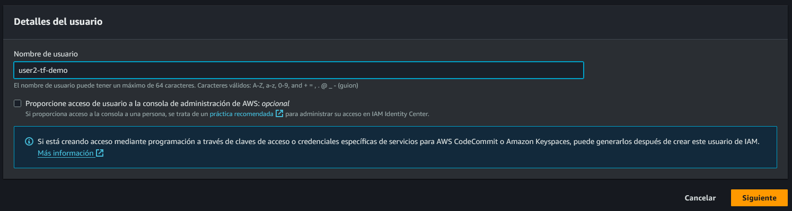
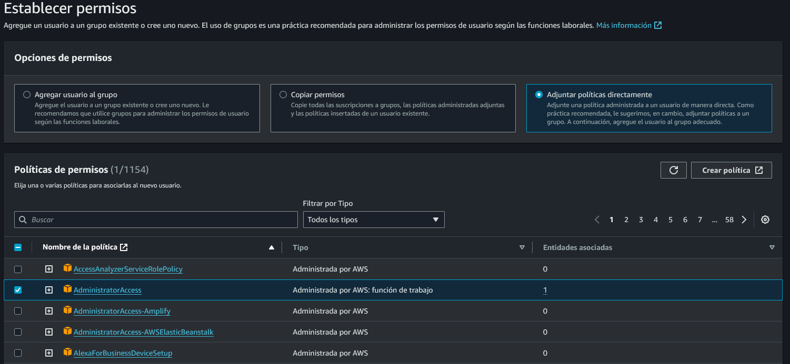
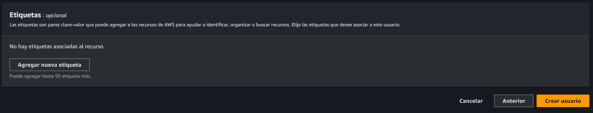
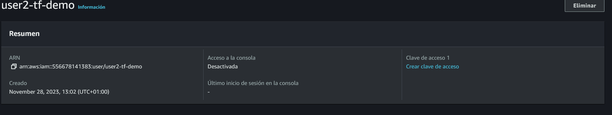
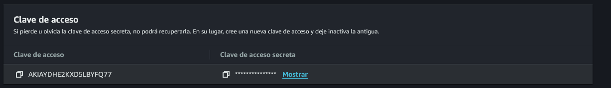

### Preparando el Area de trabajo AWS
Para trabajar en AWS con terraform, en la consola debemossaber en que region vamos a estra trabajando, para saber que regiones existen en Amazon se puede ver en la documentacion

    https://aws.amazon.com/es/about-aws/global-infrastructure/regions_az/

1. Crear en el IAM el Key y SecretKey para que nos podamos conectar desde VSCode, en la consola buscar el servicio IAM

    -> Se crea un usuario en AMI username: user1-tf-demo
    

    -> Se asignan las policies que el usuario va a tener asignadas para trabajar, evitar al maximo asignar las de administrador.
    

    -> Se deben agregar las etiquetas para identificar la funcionalidad del usuario, esto es importante para el tema de la facturación
    

    -> Luego de crear el usuario, se debe hacer la creacion de la clave de acceso, ingresando al usuario creado y dando clic en el boton de crear clave de acceso
    

    -> luego de asignar los permisos correspondientes, asigna los datos de seguridad, NO los comparta y guardelos en un lugar seguro.
    

2. En el Home directory, Crear un directorio oculto .aws y dentro de este colocar un archivo credentials donde colocara los datos de key y secret-key, en linux se hace de la siguiente forma:

        cat ~/.aws/credentials

    Este carga la estructura de la informacion que debe ir dentro del archivo credentials

        [default]
        aws_access_key_id=
        aws_secret_access_key=

se debe ingresar al archivo credentials y colocar las credenciales de key y secret key suministradas por el usuario de AWS creado desde el IAM

los comandos a utilizar seran:

    -> terraform init => para inicializar el terraform en nuestro ambiente de trabajo, este se ejecuta 1 sola vez, para traer los binarios de Terraform
    -> terraform plan => Este verifica que la configuracion esta correcta para trabajar con AWS
    -> terraform apply => Aplica la solicitud en AWS segun lo construido
    